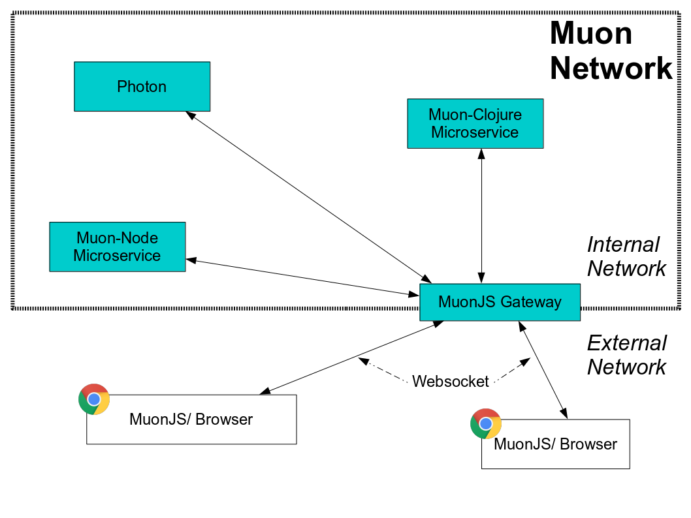

:title: Muon.js Gateway
:date: 2015-01-05 11:40
:comments: true
:sharing: true
:source-highlighter: pygments
:toc: right
:toc-title: Muon.js Gateway
:toclevels: 6

:includedir: .
ifdef::env-doc[]
:includedir: submodules/muonjs-gateway/doc
endif::[]

## Muon.js Gateway

This component enables you to run Muon.js services within a browser context and connect them to a full Muon back end network.

Primarily, this allows you to build Muon based rich clients in the browser and make use of the richer protocols Muon provides.

[[gateway]]
.MuonJS Gateway

### Setup

The gateway is part of the link:https://github.com/muoncore/muon-starter[Muon Starter] project used in the link:/guide[Guide].

You can run it by itself via Docker with the coordinates `simplicityitself-muon-image.jfrog.io/muonjs-gateway`

It requires the environment variable `MUON_URL` to be set to initialise the transport and discovery subsystems.

It will then open up port 9898 for websocket connections from the Muon.js websocket transport.

There are currently no configuration options for the service.

.Discovery Restrictions
****
Currently, the gateway does not propogate discovery information into the client, as this would expose your internal
layout to external clients.  A full featured security model is in development that will enable this
restriction to be lifted in the future.
****

### Roadmap

This service will be developed much more when the security model in development is completed.
At that point this service will be upgraded with a full permission based model enabling MuonJS client
connections to be managed securely based on the service/ user/ application being handled.

Until then, there is no security system built into this service.
